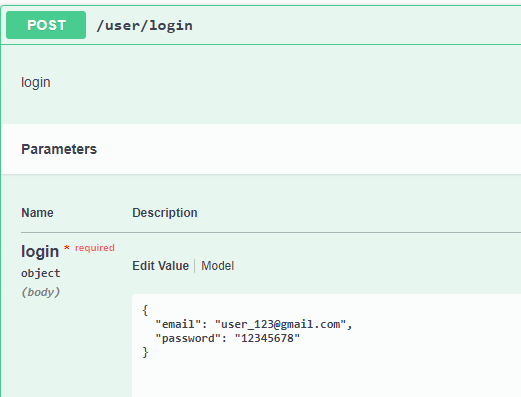
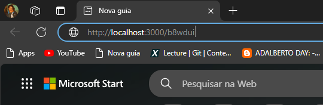
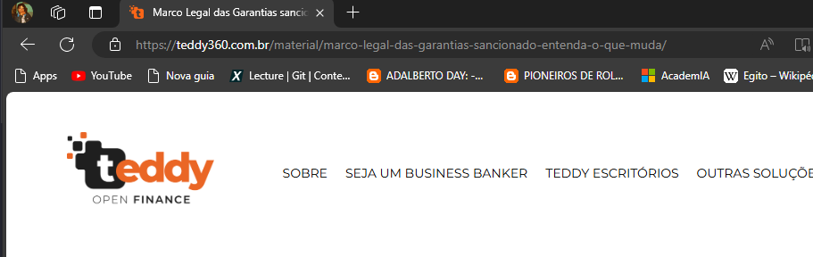

## Descrição

O encurtador de links é uma ferramenta simples que associa o link a um pequeno shortId que pode ser usado tanto por usuários autenticados como por usuários sem autenticação. Isso pode ser implementado no domínio de sua preferência, basta mudar nas variáveis de ambiente.

## Uso básico

Para utilizar a aplicação em sua máquina é muito simples, basta digitar seguinte comando no seu bash:

```
$ docker-compose up
```

A aplicação vai subir junto com o banco de dados.
O próximo passo é usar o swagger para testar os endpoints, basta acessar através do seu navegador o host com a porta configurada nas variaveis de ambiente seguido do sufixo /api
exemplo: http://localhost:3000/api

### Alguns exemplos de uso

Criar um novo usuário:
s

Fazer login e obter o token:



Reset de senha:


(to know more about husky: https://typicode.github.io/husky/#/)

Criar URL com autenticação (O token deve vir depois da palavra Bearer e um espaço)


Criar URl sem autenticação (basta mandar o campo Authorization vazio)


Listar urls criadas com autenticação ( cada usuário poderá listar apenas as suas URLs)


O mesmo se aplica para atualizar a URL de origem, cada usuário poderá atualizar apenas as URLS cadastradas por ele


Ao deletar uma URL, ela não aparecerá novamente nas listagens do usuário

Listagem vazia


Agora, para de fato utilizar a URL encurtada, basta copiar o que foi retornado no ednpoint de cadastro de URL e colar no seu navegador, você será redirecionado para o site da URL original.



Redirecionamento


## Outros comandos

Para instalar as dependências

```
$ npm install
```

Para executar os builds

```
$ npm run build
```

Para executar os arquivos do build

```
$ npm start
```

Para executar em modo deseolvimento

```
$ npm run dev
```

Caso queria rodar algum desses últimos dois comandos que estão fora do docker-compose, é necessário ter um banco de dados apontando para seu localhost, após ter essse banco você deve rodar as migrations para que as tabelas sejam inceridas

```
$ npx prisma migrate dev
```

Para executar todos os testes automatizados

```
$ npm run test
```

Para obter a cobertura dos testes

```
$ npm run test:coverage
```

## Detalhes

Caso haja algum problema no desenvolvimento é possível entender o que está acontecendo indo na pasta 'logs', lá existe um arquivo de mostra de forma detalhada os erros de servidor.

Caso queria contribuir basta fazer um fork e em seguida uma PR, mas lembre de garantir que todos os testes estão passando antes de subir, pois a aplicação é monitorada pelo Circle CI que executa os testes e o build toda vez que a aplicação é atualizada


Para saber mais sobre o circleci basta visitar: https://circleci.com/docs/
